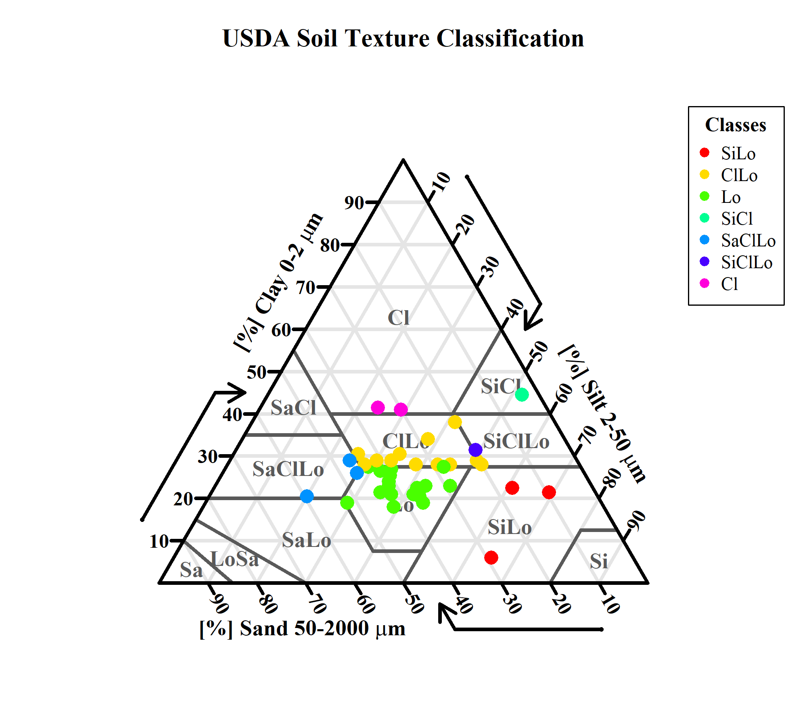

<h1 align="center">Soil Texture Classification and Spatial Mapping Using Field Samples and World Soil Grid Data</h1>
<p align="center">
  
</p>  

This project focuses on classifying soil texture using field sample data and generating spatially continuous maps using spatial interpolation (Kriging & IDW) techniques in R. The results are compared with the World Soil Grids prediction raster dataset to assess spatial variability and map accuracy.
## Research Question
How do USDA soil texture classes derived from field soil samples differ from those estimated by the World Soil Grid, and what spatial patterns emerge when using different interpolation techniques (Kriging & IDW) in R?
## Hypothesis
Field-derived soil texture classes will show finer spatial variation than World Soil Grid predictions, with higher disagreement in areas of micro-scale heterogeneity.
## Objective
To classify soil texture using the USDA texture triangle, map spatial variability using interpolation techniques, and compare results with World Soil Grids data.
## Data Sources
#### 1. Field Soil Data
- Sand (%), Silt (%), Clay (%)
- Coordinates (WGS84)
- Format: CSV / XLSX
#### 2. World Soil Grid (ISRIC)
- Sand, Silt, Clay (5-15 cm depth)
- Resolution: 250 m
- Format: GeoTIFF
#### 3. Study Area
-  Shapefile defining the project boundary (Jaranwala, Pakistan)
## Folder Structure
```r
# Soil-Texture-Mapping/
│
├── README.md                    # Project overview
├── LICENSE                      # MIT license
├── .gitignore                   # Ignored files
│
├── Data/
│   ├── Raw/                     # Original datasets (CSV, shapefiles)
│   └── Processed/               # Cleaned/normalized data/raster files
│
├── Requirements.txt             # R packages list & data requirements
│
├── Scripts/
│   ├── 01 Data_Cleaning.R       # Data preprocessing
│   ├── 02 Classification.R      # USDA soil texture classification
│   └── 03 Mapping.R             # Spatial Interpolation (Kriging & IDW) & Mapping
│                                # USDA Soil Texture & Comparision
│                                # SoilGrids data USDA texture classification & mapping
├── Outputs/
│   ├── Figures/                 # Generated maps
│   └── Tables/                  # Classification results
│
└── Documents/
    └── Final_Report.qmd         # Quarto analytical report
```
## Methods
- Clean and standardize soil sample data
- Classify soil texture using soiltexture package
- Interpolate sand/silt/clay using IDW & Kriging
- USDA classification and Mapping
- Compare with World Soil Grids data
- Generate maps and summary tables
## How to Run This Project
**1.** Install required packages:
```r
# source("requirements.txt")
```
**2.** Run scripts in the following order:
- `01_Data_Cleaning.R`
- `02_Classification.R`
- `03_Mapping.R`

**3.** Render the Quarto report:
```r
# Quarto render Documents/Final_Report.qmd
```
## Results 
### 1. USDA Soil Texture Triangle
<p align="center">
  
</p>
  
### 2. Kriging, IDW, and SoilGrids Data Mapping & Comparison  
  

## Conclusion
This project demonstrates that interpolated soil texture maps generated from field samples (Kriging and IDW, 250 m) reveal finer spatial variability than the global SoilGrids product. While SoilGrids offers a consistent regional baseline, the interpolation methods capture local heterogeneity reflected in measured texture class differences. This underscores the value of field data and suitable spatial interpolation when high-resolution or site-specific soil information is needed.
## Acknowledgements
This project was developed with valuable support and inspiration from several open-source tools and data providers. The core code flow builds upon the excellent [soiltexture](https://doi.org/10.32614/CRAN.package.soiltexture) package by [Julien Moeys](https://github.com/julienmoeys/soiltexture). Additional inspiration was drawn from the [ggsoiltexture](https://doi.org/10.1016/j.softx.2025.102293) project of [Sara Acevedo](https://github.com/Saryace/ggsoiltexture). I also acknowledge all other R packages that are used in building this workflow. Special thanks to the [global SoilGrids (250 m)](https://soilgrids.org/) dataset for providing essential soil information used in this project.
## Author
**Noman Ahmad**  
Doctorate in Agricultural and Natural Sciences  
AGP3141 – Environmental Data Visualization in R  
Date: Spring 2025  
[Linkedin](https://www.linkedin.com/in/noman-ahmad-6960bb176/); [ResearchGate](https://www.researchgate.net/profile/Noman-Ahmad-11?ev=hdr_xprf); [ORCiD](https://orcid.org/0000-0002-2663-9190)


